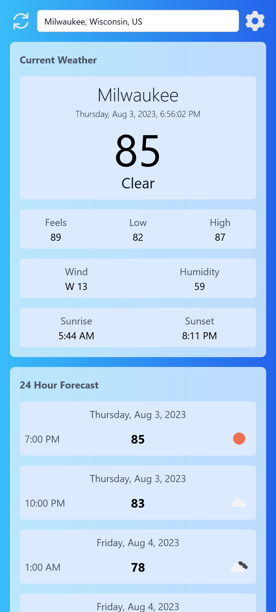

# Weather

## About

A frontend weather widget utilizing the
[OpenWeather](https://home.openweathermap.org) API.

Settings like API key are saved and reloaded from localstorage.

## Tech

1. [Typescript](https://www.typescriptlang.org/)
2. [React](https://react.dev/)
3. [TailwindCSS](https://tailwindcss.com)
4. [TailwindUI](https://tailwindui.com)
5. [Vite](https://vitejs.dev/)

## Before you begin

Before you try to run this project you will need to obtain a free API key from
[OpenWeather](https://home.openweathermap.org)!

So go ahead and sign up and then from the top menu
click your user name and then from the dop down
select [My Api Keys](https://home.openweathermap.org/api_keys).

## How to run

1. Install [Node.js LTS](https://nodejs.org/en);
2. Clone this repo to the directory of your choice.
3. From the project root run `npm install`.
4. From the project root run `npm run dev`.
5. ... profit!

## Commands

* `npm run dev` - starts a local web server that serves a dev version
* `npm run build` - build the project and places it in the `./src/dist`
* `npm run preview` - start a local web server that serves the built solution
  from `./src/dist`
* `npm run lint` - runs [eslint](https://eslint.org/)
* `npm run format` - formats project source
  with [prettier](https://prettier.io/)
* `npm run test:unit` - runs tests
* `npm run type-check` - runs the [Typescript](https://www.typescriptlang.org/)
  type checker ([Vite](https://vitejs.dev/) does not typecheck)